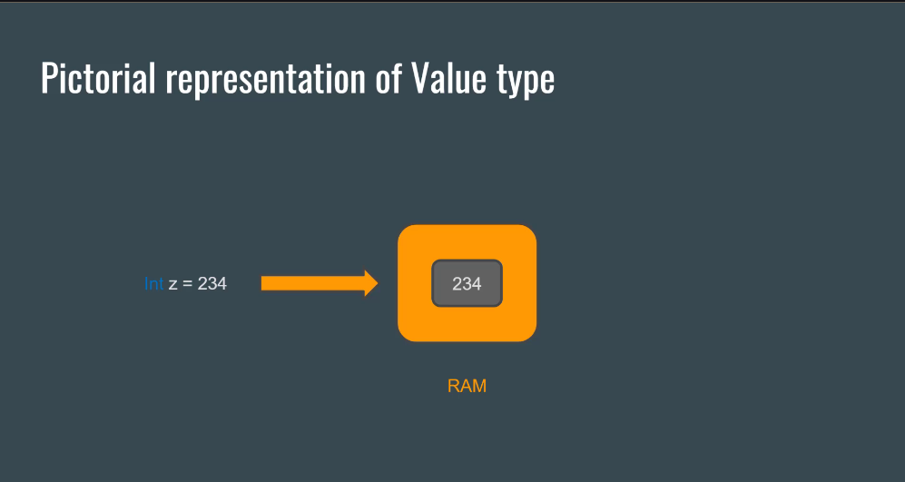
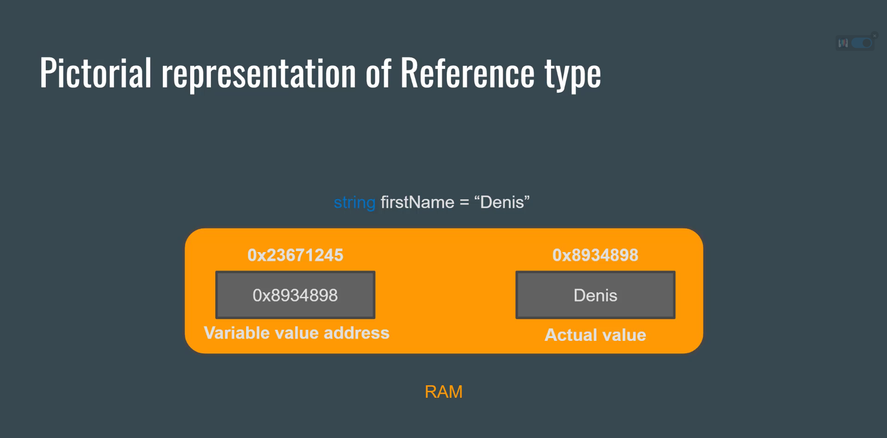

## data types <!-- markdownlint-disable-line MD041 -->

there are several datatypes in c# Categrize in

1. referenc types : `string, object, dynamic`
2. value types : `char int, decimal , float, unsigned int , signed int, long, short, double`
3. user-definrd types : `classes, struct enum`
4. pointer types (unsafe context) : `pointer`
5. structured types : `class, record, struct, enum, delegate`
6. nullable types : `nullable<>`

## variable: values vs refrences

these are based on how data types occupy the memory location

### value

stored actual data directly

- Typically stored in the stack <mark style="background-color: rgba(255, 235, 59, 0.4);color: #d4dfe7;"> <!-- markdownlint-disable-line MD033  --> meaning they allocation and deacllocation are managed automatically as the program grows</mark>
- common example like : `int char enum struct`
- there is also nullable version types
- they can be stored in the heap as part of reference types like `arrays, fields`

### reference

is a variable type which instead of storing the value in memory directly, stores the ***memory location of the actual data***

the variable here stores the memory refernce of the data not the data direcly.

- common example : `class array string`
- when copying this refrence type of a data type it will just copy the memory address of the data so we will then have two variable pointing to thee same data

