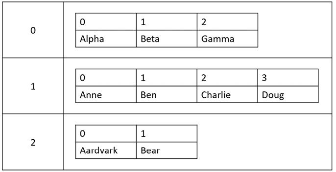

# arrays

- `array`: A data structure capable of storing multiple variables of the same type (like an array of strings).
- Arrays are fixed-size (static) structures with a length specified when they are instantiated.
- Because an array has a fixed size, you must use `Array.Resize(ref YOUR_ARRAY, new_size);` to resize it. This has low performance since it requires allocating a new array and copying all elements every time you call it.
- The trailing comma after the last item in the `switch` , `arrays` etc expression is optional and the compiler will not complain about it.

## Declaring and Instantiating Arrays

- Declaring an array means specifying its type, while instantiating it allocates the memory for its size.
  
    > - `type` is the array type, like `int` or `float`.
    > - `size` defines how many elements the array can hold.
    >
    >```csharp
    > TYPE[] array_name = new TYPE[SIZE]; // Declaration and instantiation
    > ```
    >
    > Note: If you access this array directly after instantiating it, the elements will contain the defined type's default value (e.g., `0` for ints, `null` for strings).

- To initialize the array with specific values right away, you can use a collection expression:
  
    > - The size is automatically defined by how many elements are passed.
    > - All passed elements must match the specified type.
    >
    >```csharp
    > float[] myFloatArray = [12, 21, 21.3f, 21, 21]; // Initialization (note the 'f' for float)
    > ```

## Indexing

- Array indexing starts at `0` and goes up to `(array size) - 1`.
- Accessing an index outside of this defined range will throw an `IndexOutOfRangeException` at **runtime**.
- `yourArray.Length` is a property used to get the total size (number of elements) of the array.
  
    > An example of array indexing:
    >
    >```csharp
    > double[] myDoubleArray = [12, 21, 21.3, 21, 21]; 
    > double firstElement = myDoubleArray[0]; // Accesses the number 12
    > int size = myDoubleArray.Length; // Returns 5
    > ```

- to access an action on all the element of an array you have to use loops either by useing:
    1. `foreach` loops

        > an example of that is
        >
        > ```c#
        > string[] weekDays = ["sunday","monday","tuesday","wendnesday","thrusday","friday","saturday"];
        > foreach (var item in weekDays)
        > {
        > WriteLine($"{item} is in weekDays");
        > }
        > ```
        >
        > you are dealing with the element itself which is less error prone and alot safer

    2. `for` loops : this consider the more classic way of accessing all the elements

        > an example that is
        >
        > ```c#
        > double[] myDoubleArray2 = [12,21,21.3,21,21,12.4,132.23,21.3]; 
        > for (int index = 0; index < myDoubleArray2.Length; index++)
        > {
        >     WriteLine($"{myDoubleArray2[index]} is in {nameof(myDoubleArray2)}");
        > }
        > ```
        >
        > - since you are dealing with the size itself it will be much more error prone and less safer

## array manipulation

- you can sort arrays using the built-in `sort` method which will modify your own array as well

    > ```c#
    > string[] pallets = [ "B14", "A11", "B12", "A13" ];;
    > Array.Sort(pallets); // pallets is now [A11, A13, B12, B14]
    > ```
    >
    > - it can also sort alphapetly
    > - it sort from least to most

- you can also revese the order of the array's elements using the built-in `revese` method as the folliwing

    > ```c#
    > string[] pallets = [ "B14", "A11", "B12", "A13" ];;
    > Array.Reverse(pallets); // pallets is now [B14, B12, A13, A11]
    > ```

- The `Array.Clear()` method enables you to eliminate the contents of specific elements in your array, replacing them with the array's default value.
  - if you clear an element in a `string` array, the cleared value is replaced with `null`.
  - if you clear an element in an `int` array, the replacement is `0`.

    > ```c#
    > string[] pallets = [ "B14", "A11", "B12", "A13" ];
    > Array.Clear(pallets, 0, 2);  // pallets is now [ null, "A11", null, "A13" ]
    > ```
    >
    > - notice how it doesn't resize or reduce the array's length

- to resize array to either add or remove element you shoud use `Array.Resize(ref YOUR_ARRAY, new_size)` and in this method you will pass your array by refrence

    > ```c#
    > string[] pallets = [ "B14", "A11", "B12", "A13" ];
    > Array.Resize(ref pallets, 0, 2); // pallates is now [ "B14", "A11"]
    > Array.Resize(ref pallets, 6);
    > pallets[4] = "C01";
    > pallets[5] = "C02"; // pallates is now [ "B14", "A11", null, null, C01, C02 ]
    > ```

- if you just want the maximum and minimum element you can use `Array.Max()` and `Array.Min()` they are much performant

    > ```C#
    > int[] numbers = { 5, 1, 8, 9 };
    > int maxNum = number.Max();
    > Console.WriteLine(maxNum); // Output : 9
    > ```

- you can use `..` aka spread oprator to merge arrays as the following

    > ``` C#
    > int[] oneTwoThree = [1, 2, 3];
    > int[] fourFiveSix = [4, 5, 6];
    > 
    > int[] all = [.. fourFiveSix, 100, .. oneTwoThree];
    > 
    > Console.WriteLine(string.Join(", ", all));
    > Console.WriteLine($"Length: {all.Length}");
    > // Outputs:
    > //   4, 5, 6, 100, 1, 2, 3
    > //   Length: 7
    > ```

## multi-dimensional arrays

- working with multi dimesional arrays is like working with tables and grids
- you can declare multi dimensional arrays through the same workflow of the single dimensional arrays as the following
- as for 2d arrays

    > 1. declaration
    >
    > ```c#
    > TYPE[,] my2dArray = new TYPE[col_size,row_size];
    > ```
    >
    > - you can then assign value using indexing `my2dArray[0,0] = 1` following this table
    >   > supposing that `my2dArray`'s `col_size` = 3 and `row_size` = 3 also
    >
    >    | row/col   | 0        | 1    | 2    |
    >    | --------- | -------- | ---- | ---- |
    >    | 0         | 1        | 0    | 0    |
    >    | 1         | 0        | 0    | 0    |
    >    | 2         | 0        | 0    | 0    |
    >
    > 2. initialization <!-- markdownlint-disable-line -->
    >
    > ```c#
    > int[,] myTwoDimensionalArrays= {    {1,3,4},    {8,0,23},   {12,29,15}  };
    > ```
    >
    > - you can then over-write the value using indexing `my2dArray[0,0] = 1` or access it following this table
    >
    >    | row/col   | 0      | 1     | 2     |
    >    | --------- | ------ | ----- | ----- |
    >    | 0         | 1      | 3     | 12    |
    >    | 1         | 8      | 0     | 29    |
    >    | 2         | 12     | 23    | 15    |

- as for 3D arrays
    >
    >```c#
    >// declared 3D Array
    >int[,,] array3DDeclaration = new int[3, 3, 3];
    >
    >// initialized 3D Array
    >string[,,] simple3DArray =
    >{
    >    {
    >        {"000", "001"},
    >        {"010", "011" }
    >    },
    >    {
    >        {"100", "101"},
    >        {"110", "111"}
    >    },
    >    {
    >        {"200", "201"},
    >        {"210", "211"}
    >    }
    >};
    >
    >// assign a value
    >simple3DArray[2, 1, 0] = "Hi, what's up?";
    >
    >// access an element
    >Console.WriteLine(simple3DArray[2,1,0]);
    >
    >```
>
- c# provides you with built-in functions to We the lower and upper bounds of an array using helpful methods which are
    1. `yourArray.GetLowerBound(dimension_number)` : return the minimum index number you can access in the arrays
        > the `dimension_number` represent the current wanted dimension so if you want to get the `LowerBound` of the 1st dimension then the `dimension_number` will be `0` if its the 2nd then it will be `1` and so one
    2. `yourArray.GetUpperBound(dimension_number)` : return the maximux index number you can access which will be the size of that dimension - 1

## jagged arrays

- If you need a multi-dimensional array but the number of items stored in each dimension is different, then you can define an array of arrays, aka a jagged array.
- We could visualize a jagged array as shown in the following image
    

### working with jagged arrays

- declaration

```c#
int[][] jaggedArray = new int[3][]; // An array with three inner arrays
//Assigning Inner Arrays
jaggedArray[0] = new int[] { 1, 2, 3 };
jaggedArray[1] = new int[] { 4, 5 };
jaggedArray[2] = new int[] { 6, 7, 8, 9 };

```

- initialzation

    ```c#
    // C# 11 and earlier must use curly braces and new[] expressions.
    string[][] jagged = // An array of string arrays.
    {
    new[] { "Alpha", "Beta", "Gamma" },
    new[] { "Anne", "Ben", "Charlie", "Doug" },
    new[] { "Aardvark", "Bear" }
    };

    // C# 12 and later can use collection expressions that use square brackets.
    string[][] jaggedAlt = // An array of string arrays.
    [
    [ "Alpha", "Beta", "Gamma" ],
    [ "Anne", "Ben", "Charlie", "Doug" ],
    [ "Aardvark", "Bear" ]
    ];

    ```

### Common Mistakes and Best Practices

1. Mistake: Forgetting to Initialize Inner Arrays

    ```c#
    int[][] jaggedArray = new int[3][];
    Console.WriteLine(jaggedArray[0][0]); // This will throw an error! 
    ```

    > Fix: Ensure inner arrays are initialized before accessing them.

2. Mistake: Misunderstanding Indices

   - Many programmers mistakenly treat jagged arrays as rectangular arrays. Remember that jaggedArray[i] represents an entire inner array, not just an element.

- Best Practices
  - Use jagged arrays only when inner arrays vary in length.
  - Always check for null values before accessing elements.
  - Consider multi-dimensional arrays if uniform data is needed.

## array expression from {C# 14 and .NET 10 - Modern Cross-Platform Development Fundamentals}

- you saw how an individual object supports pattern matching against its type and properties. ***Pattern matching also works with arrays and collections.***
- list pattern matching works with any type that has a public Length or Count property and has an indexer using an `int` or `System.Index` parameter.
- the next table shows examples of list pattern matching, assuming a list of int values:

    > | **Example**                           | **Description**                                                                                                                                               |
    > | ------------------------------------- | ------------------------------------------------------------------------------------------------------------------------------------------------------------- |
    > | `[]`                                  | Matches an empty array or collection.                                                                                                                         |
    > | `[..]`                                | Matches an array or collection with any number of items, including zero, so `[..]` must come after `[]` if you need to switch on both.                        |
    > | `[_]`                                 | Matches a list with any single item.                                                                                                                          |
    > | `[int item1]` or `[var item1]`        | Matches a list with any single item and can use the value in the return expression by referring to `item1`.                                                   |
    > | `[7, 2]`                              | Matches exactly a list of two items with those values in that order.                                                                                          |
    > | `[_, _]`                              | Matches a list with any two items.                                                                                                                            |
    > | `[var item1, var item2]`              | Matches a list with any two items and can use the values in the return expression by referring to `item1` and `item2`.                                        |
    > | `[_, _, _]`                           | Matches a list with any three items.                                                                                                                          |
    > | `[var item1, ..]`                     | Matches a list with one or more items. Can refer to the value of the first item in its return expression by referring to `item1`.                             |
    > | `[var firstItem, .., var lastItem]`   | Matches a list with two or more items. Can refer to the value of the first and last item in its return expression by referring to `firstItem` and `lastItem`. |
    > | `[.., var lastItem]`                  | Matches a list with one or more items. Can refer to the value of the last item in its return expression by referring to `lastItem`.                           |

- here is an a method that implenets array expression

    >```C#
    > static string CheckSwitch(int[] values) => values switch
    > {
    >   [] => "Empty array",
    >   [1, 2, _, 10] => "Contains 1, 2, any single number, 10.",
    >   [1, 2, .., 10] => "Contains 1, 2, any range including empty, 10.",
    >   [1, 2] => "Contains 1 then 2.",
    >   [int item1, int item2, int item3] =>
    >     $"Contains {item1} then {item2} then {item3}.",
    >   [0, _] => "Starts with 0, then one other number.",
    >   [0, ..] => "Starts with 0, then any range of numbers.",
    >   [2, .. int[] others] => $"Starts with 2, then {others.Length} more numbers.",
    >   [..] => "Any items in any order.", // <-- Note the trailing comma for easier re-ordering.
    >   // Use Alt + Up or Down arrow to move statements.
    > };
    >```
